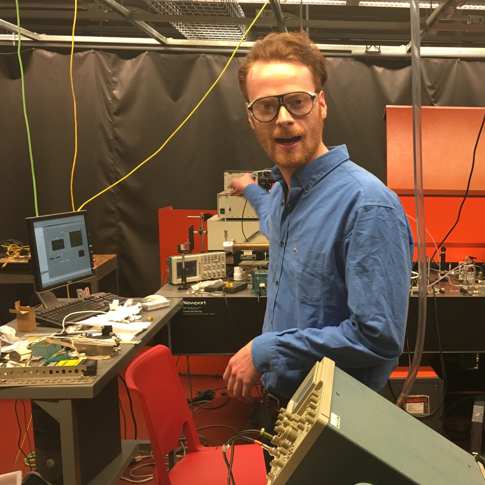

# Excited State
### Hosted by Sean Bresler

 
 

Stand-in description of the show and it's purpose.  This document serves as the landing page for the website.  

**TODO:**
* Hoping to add the top five latest episodes to a menu on the side, could also use a standard link to a listing of episodes.  
* Maybe a search bar for episodes?  
* May have to adopt the minima scheme for adding new pages with a `_post` directory in the GitHub repo.

[This is a crude link to another pate](./another-page.html).
